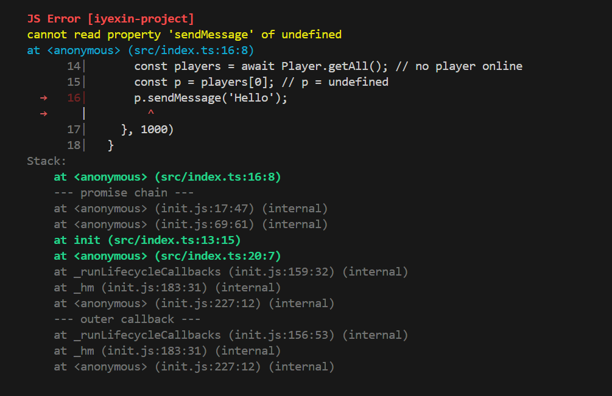

# 快速开始

> **Yeow Beta 已在 PaperMC Hangar 发布**：[https://hangar.papermc.io/iYeXin/Yeow/versions](https://hangar.papermc.io/iYeXin/Yeow/versions)

> [!TIP]
> **AI 辅助编程**：本页为人工阅读版。若你正在使用 AI 编程助手（Codex、OpenCode、DSH 等 Harness 产品），建议先让 AI 阅读 [AI 辅助启动指南](/ai-agent)——在任何 Harness 产品中，**复制该链接或页面内容发送给 AI**，并描述你的需求（如"创建一个带 /back 命令的插件"），AI 将带领你完成项目创建、开发与调试。完整文档亦可打包下载（[docs.zip](/docs.zip)）喂给 AI。

## 创建项目

```bash
npm create yeow@latest -- -y               # JavaScript（默认）
npm create yeow@latest -- -y --ts          # TypeScript
cd my-plugin
npm install
```

> [!IMPORTANT]
> **强烈建议优先选用 TypeScript**——尤其是** AI 辅助编程**：完整的类型推断（命令参数、事件 payload、API 返回值）让编辑器与 AI 获得完善的类型支持，杜绝静态错误，显著降低"模型幻觉"（编造不存在的 API/字段/类型）。`npm create yeow@latest -- -y --ts` 一步创建。


## 开发

```bash
npm run dev                    # 启动 Paper 服务器 + 热重载
```

编辑 `src/` 或 `assets/` 下的文件自动触发热重载，无需重启服务器。

开发模式下，运行时错误会自动定位到**源码位置**（source-map 反解）并附带完整异步调用链，直接在终端展示：



## 构建与部署

```bash
npm run build                  # 生产产物 → dist/<name>-<version>.jar + .yeow.zip
```

`npm run build` 产出两种部署形态：

| 产物                             | 说明                                                                         |
| -------------------------------- | ---------------------------------------------------------------------------- |
| `dist/<name>-<version>.jar`      | 标准 Paper JAR（含 Bootstrap 类 + `depend: Yeow`），放入 `plugins/` 即可运行 |
| `dist/<name>-<version>.yeow.zip` | **平台无关插件包**（纯 ZIP：`.yeow/main.js` + `assets/` + `yeow.json`）      |

三种部署方式（任选其一）：

1. **JAR 方式**：把 `yeow-runtime-0.5.0.jar` 和插件 JAR 一同放入 `plugins/`（与原生 Java 插件部署一致）
2. **自动扫描**：把插件 `.yeow.zip` 放入 `plugins/Yeow/`，服务器启动时自动加载
3. **命令加载**：服务器运行中执行 `/yeow load <path>`（本地临时加载）、`/yeow load <url>`（下载临时加载）、`/yeow install <url>`（下载并安装到 `plugins/Yeow/`）、`/yeow update <url>`（替换旧版本）

> **同名实例唯一**：无论通过哪种方式加载，一个插件名只能存在一个实例——重复加载会被拒绝并输出警告。

> **分发建议**：两种产物应同时上传（`.yeow.zip` 推荐、`.jar` 兼容），并提供 `/yeow install <url>` 一键安装。详见 [构建与分发](distribution.md)。

> **平台无关（Paper / Folia 双平台通用）**：`.yeow.zip` 本身不依赖 Java 或 Paper 系——任何实现 [平台规范](specifications/README.md) 的运行时（理解包结构、调度器、执行器、JS 桥）都能运行同一份插件。**同一份插件包可直接在 Paper 与 [Folia](https://papermc.io/software/folia/) 服务器间互换**：Folia 服务器只需安装 Folia 版 [Yeow 运行时](https://hangar.papermc.io/iYeXin/Yeow/versions)（Hangar 提供），插件自动享受 Folia 的多线程优势（详见 [进阶知识 · Folia](advanced/folia.md)）。Paper 系（Paper/Purpur/Leaf 等）的 yeow-runtime 是官方实现示例。

## 项目结构

```
my-plugin/
├── src/
│   └── index.ts              ← 入口（TS 默认）
├── assets/                   ← 打包资源（图片、配置、原生程序）
├── .yeow/                    ← 构建脚本 + Paper + 运行时 JAR
├── dist/                     ← 构建产物
├── yeow.config.json          ← 插件配置
├── tsconfig.json             ← 仅 TS 模式
└── package.json
```

## 第一个插件

实现 `/back`：记录玩家死亡位置，输入 `/back` 传送回去。

```ts
import {
  onLoad, onUnload, registerCommand, eventOn,
  Player, Location, pdcSet, pdcGet, log,
} from 'yeow-api';

onLoad(() => {
  // 记录所有死亡位置，并通知玩家
  eventOn('playerDeath', async (e) => {
    const loc = e.player.location;
    if (loc) {
      // PDC 自动 JSON 序列化：直接存取对象（无需手写 JSON.stringify/parse）
      pdcSet(e.player.uuid, 'back.deathLocation', { x: loc.x, y: loc.y, z: loc.z, world: loc.world || e.player.world });
      await e.player.sendMessage(
        `<red>You died!</red> <gray>Use</gray> <click:run_command:/back><aqua><u>/back</u></aqua></click> <gray>to return</gray>`,
      );
    }
  });

  // /back — 返回死亡位置
  registerCommand('back', {
    description: 'Teleport to your death location',
    executor: async (p) => {
      const loc = await pdcGet(p.sender.uuid, 'back.deathLocation');
      if (!loc) return p.sender.sendMessage('<red>No death location recorded</red>');

      const player = await Player.get(p.sender.uuid);
      if (player) {
        await player.teleport(new Location(loc.x, loc.y, loc.z, 0, 0, loc.world));
        p.sender.sendMessage('<green>Teleported to death location</green>');
      }
    },
  });

  log.info('MyPlugin loaded');
});

onUnload(() => {
  log.info('MyPlugin unloaded');
});
```

> **生命周期**：游戏 API 操作需在 `onLoad` 内进行。`onLoad` 外的顶层代码只能注册回调，不能操作游戏。

## 异步优先

Yeow API 默认异步（`Promise`），同步操作加 `Sync` 后缀：

```ts
// 异步 — 不阻塞 JS 线程
await player.sendMessage('<green>Hello</green>');
await world.setBlock(0, 65, 0, 'minecraft:stone');
await broadcast('Hello!');
const p = await Player.get('Notch');

// 同步 — 阻塞直到完成
player.sendMessageSync('<red>Urgent!</red>');
const q = Player.getSync('Notch');
```

属性访问（`player.ping`、`world.time`）始终同步。

> 大量重复操作请用异步 API（`await` 循环），避免阻塞 JS 线程。详见 [进阶知识](advanced.md)。

> [!WARNING]
> **事件处理器中慎用同步操作**：事件处理期间同步调用（含属性读写）可能触发**事件重入死锁**（Paper/Folia 均存在，阻塞游戏线程至超时）——详见 [事件与回调 - 事件重入死锁](advanced/events.md#事件重入死锁)。

## 常用 API 速览

| 想做什么                 | 用什么                                                       | 文档                      |
| ------------------------ | ------------------------------------------------------------ | ------------------------- |
| 玩家发消息 / 传送 / 属性 | `player.sendMessage()` / `player.teleport()` / `player.ping` | [Player](api/player.md)   |
| 设置方块 / 时间 / 天气   | `world.setBlock()` / `world.time`                            | [World](api/world.md)     |
| 订阅事件                 | `eventOn('playerJoin', handler)`                             | [Event](api/event.md)     |
| 注册命令 + Tab 补全      | `registerCommand()` 或 `Command.create()`                    | [Command](api/command.md) |
| 读写插件数据文件         | `fs.readFileSync()` / `fs.writeFileSync()`                   | [FS](api/fs.md)           |
| 读取打包资源             | `getAssetsPath()`（`yeow-dev`）+ `assetsReadSync()`          | [Assets](api/assets.md)   |
| 插件间通信 / 原生程序    | `registerService()` / `registerNativeService()`              | [Service](api/service.md) |
| 日志                     | `log.info()` / `console.log()`                               | [Log](api/log.md)         |

完整索引见 [API 参考](api/README.md)。

## 权限与原生服务

Yeow 对**敏感消息节点**实施声明式权限（服务器文件、HTTP、原生进程、解压资源需声明，插件数据目录免声明）；声明了原生服务的插件默认需要控制台批准才能加载。完整参考见 [权限与原生服务可信性](permissions.md)。

> 快速要点：只读写插件自己的数据目录时**无需声明任何权限**；使用 `fetch` / HTTP 需声明 `"http:*"` 或 `"http:requestAsync"`；声明原生服务需 `"service:registerNative"`。

## 运行时运维

`/yeow` 管理命令（load / install / update / unload / reload / profile 等）与运行时配置（`plugins/Yeow/runtime/config.yml`）见 [运行时运维](operations.md)。

## 遇到问题？

插件出现异常行为时，运行时会在控制台输出结构化警告（心跳超时、事件超时、队列积压等），并给出排查建议：


- 运行时警告（心跳超时、事件超时等）→ [运行时警告指南](runtime-warning.md)
- 详细架构与线程模型 → [进阶知识](advanced.md)

## 文档压缩包与站点地图

- **站点地图**：全部文档页面的结构（标题 + 摘要 + URL），便于 AI 代理 / Vibe Coding 快速定位资料：[站点地图](/sitemap)
- **文档压缩包**：全部 Markdown 源码（含站点地图）打包下载，供离线查阅 / 喂给 AI：[docs.zip](/docs.zip)（构建时生成，zip 格式）
