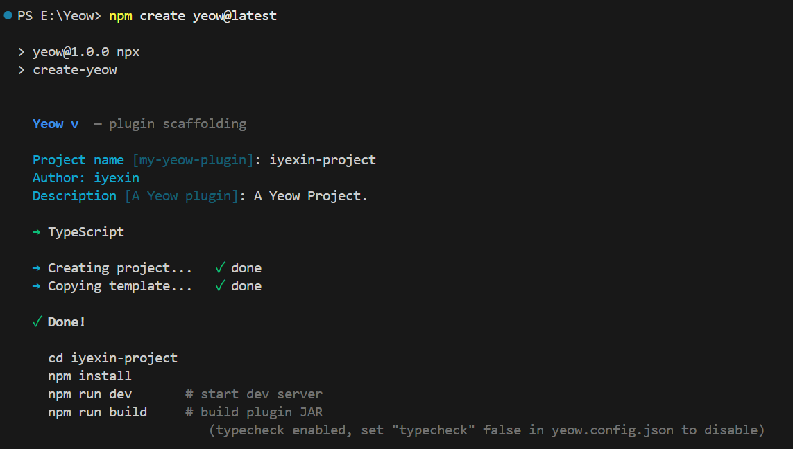

# Quick Start

> **Yeow Beta is now available on PaperMC Hangar**: [https://hangar.papermc.io/iYeXin/Yeow/versions](https://hangar.papermc.io/iYeXin/Yeow/versions)

> [!TIP]
> **AI-Assisted Programming**: This page is for human reading. If you're using an AI programming assistant (Codex, OpenCode, DSH and other Harness products), it's recommended to first have the AI read the [AI-Assisted Startup Guide](/ai-agent) — in any Harness product, **copy this link or page content to the AI**, and describe your needs (e.g., "create a plugin with a /back command"), the AI will guide you through project creation, development, and debugging. Complete documentation can also be downloaded as a package ([docs.zip](/docs.zip)) to feed to the AI.

## Create Project

```bash
npm create yeow@latest -- -y               # JavaScript (default)
npm create yeow@latest -- -y --ts          # TypeScript
cd my-plugin
npm install
```

> [!IMPORTANT]
> **It is strongly recommended to use TypeScript first** — especially for **AI-assisted programming**: complete type inference (command parameters, event payloads, API return values) gives editors and AI perfect type support, eliminates static errors, and significantly reduces "model hallucinations" (inventing non-existent APIs/fields/types). `npm create yeow@latest -- -y --ts` creates in one step.



## Development

```bash
npm run dev                    # Start Paper server + hot reload
```

Editing files under `src/` or `assets/` automatically triggers hot reload without restarting the server.

In development mode, runtime errors automatically locate to **source code positions** (source-map reverse resolution) with complete async call chains, displayed directly in the terminal:


## Build and Deployment

```bash
npm run build                  # Production artifacts → dist/<name>-<version>.jar + .yeow.zip
```

`npm run build` produces two deployment forms:

| Artifact                         | Description                                                                    |
| -------------------------------- | ------------------------------------------------------------------------------ |
| `dist/<name>-<version>.jar`      | Standard Paper JAR (includes Bootstrap class + `depend: Yeow`), place in `plugins/` to run |
| `dist/<name>-<version>.yeow.zip` | **Platform-independent plugin package** (pure ZIP: `.yeow/main.js` + `assets/` + `yeow.json`) |

Three deployment methods (choose one):

1. **JAR Method**: Place `yeow-runtime-0.5.0.jar` and plugin JAR together in `plugins/` (same as native Java plugin deployment)
2. **Auto-scan**: Place plugin `.yeow.zip` in `plugins/Yeow/`, automatically loaded on server startup
3. **Command Load**: While server is running, execute `/yeow load <path>` (local temporary load), `/yeow load <url>` (download temporary load), `/yeow install <url>` (download and install to `plugins/Yeow/`), `/yeow update <url>` (replace old version)

> **Unique Instance per Name**: Regardless of loading method, only one instance of a plugin name can exist — duplicate loading will be rejected with a warning.

> **Distribution Recommendation**: Both artifacts should be uploaded (`.yeow.zip` recommended, `.jar` for compatibility), with `/yeow install <url>` one-click installation provided. See [Build & Distribution](distribution.md).

> **Platform-Independent (Paper / Folia dual-platform compatible)**: `.yeow.zip` itself doesn't depend on Java or Paper series — any runtime implementing the [Platform Specification](specifications/README.md) (understanding package structure, scheduler, executor, JS bridge) can run the same plugin. **The same plugin package can be directly interchanged between Paper and [Folia](https://papermc.io/software/folia/) servers**: Folia servers only need to install the Folia version of [Yeow Runtime](https://hangar.papermc.io/iYeXin/Yeow/versions) (available on Hangar), plugins automatically enjoy Folia's multi-threaded advantages (see [Advanced Knowledge · Folia](advanced/folia.md)). Paper series (Paper/Purpur/Leaf etc.) yeow-runtime is the official implementation example.

## Project Structure

```
my-plugin/
├ src/
│  └ index.ts              ← Entry (TS default)
├ assets/                   ← Packaged resources (images, configs, native programs)
├ .yeow/                    ← Build scripts + Paper + Runtime JAR
├ dist/                     ← Build artifacts
├ yeow.config.json          ← Plugin configuration
├ tsconfig.json             ← TS mode only
└ package.json
```

## First Plugin

Implement `/back`: Record player death location, type `/back` to teleport back.

```ts
import {
  onLoad, onUnload, registerCommand, eventOn,
  Player, Location, pdcSet, pdcGet, log,
} from 'yeow-api';

onLoad(() => {
  // Record all death locations and notify player
  eventOn('playerDeath', async (e) => {
    const loc = e.player.location;
    if (loc) {
      // PDC auto JSON serialization: directly store/retrieve objects (no need for manual JSON.stringify/parse)
      pdcSet(e.player.uuid, 'back.deathLocation', { x: loc.x, y: loc.y, z: loc.z, world: loc.world || e.player.world });
      await e.player.sendMessage(
        `<red>You died!</red> <gray>Use</gray> <click:run_command:/back><aqua><u>/back</u></aqua></click> <gray>to return</gray>`,
      );
    }
  });

  // /back — Return to death location
  registerCommand('back', {
    description: 'Teleport to your death location',
    executor: async (p) => {
      const loc = await pdcGet(p.sender.uuid, 'back.deathLocation');
      if (!loc) return p.sender.sendMessage('<red>No death location recorded</red>');

      const player = await Player.get(p.sender.uuid);
      if (player) {
        await player.teleport(new Location(loc.x, loc.y, loc.z, 0, 0, loc.world));
        p.sender.sendMessage('<green>Teleported to death location</green>');
      }
    },
  });

  log.info('MyPlugin loaded');
});

onUnload(() => {
  log.info('MyPlugin unloaded');
});
```

> **Lifecycle**: Game API operations must be performed within `onLoad`. Top-level code outside `onLoad` can only register callbacks, not operate on the game.

## Async-First

Yeow API is async by default (`Promise`), synchronous operations add `Sync` suffix:

```ts
// Async — Does not block JS thread
await player.sendMessage('<green>Hello</green>');
await world.setBlock(0, 65, 0, 'minecraft:stone');
await broadcast('Hello!');
const p = await Player.get('Notch');

// Synchronous — Blocks until complete
player.sendMessageSync('<red>Urgent!</red>');
const q = Player.getSync('Notch');
```

Property access (`player.ping`, `world.time`) is always synchronous.

> For large numbers of repetitive operations, use async API (`await` loops) to avoid blocking the JS thread. See [Advanced Knowledge](advanced.md).

> [!WARNING]
> **Use synchronous operations cautiously in event handlers**: Synchronous calls (including property reads/writes) during event processing may trigger **event reentrant deadlock** (exists in both Paper/Folia, blocks game thread until timeout) — see [Events & Callbacks - Event Reentrant Deadlock](advanced/events.md#event-reentrant-deadlock).

## Common API Overview

| What You Want to Do              | What to Use                                                    | Documentation             |
| -------------------------------- | -------------------------------------------------------------- | ------------------------- |
| Player send message / teleport / properties | `player.sendMessage()` / `player.teleport()` / `player.ping` | [Player](api/player.md)   |
| Set block / time / weather       | `world.setBlock()` / `world.time`                              | [World](api/world.md)     |
| Subscribe to events              | `eventOn('playerJoin', handler)`                               | [Event](api/event.md)     |
| Register command + Tab completion | `registerCommand()` or `Command.create()`                      | [Command](api/command.md) |
| Read/write plugin data files     | `fs.readFileSync()` / `fs.writeFileSync()`                     | [FS](api/fs.md)           |
| Read packaged resources          | `getAssetsPath()` (`yeow-dev`) + `assetsReadSync()`            | [Assets](api/assets.md)   |
| Inter-plugin communication / native programs | `registerService()` / `registerNativeService()`        | [Service](api/service.md) |
| Logging                          | `log.info()` / `console.log()`                                 | [Log](api/log.md)         |

Complete index see [API Reference](api/README.md).

## Permissions and Native Services

Yeow implements **declarative permissions** for **sensitive message nodes** (server files, HTTP, native processes, and extracted resources require declaration; plugin data directory does not); plugins declaring native services require console approval to load by default. Complete reference see [Permissions & Native Service Trust](permissions.md).

> Quick points: **No permission declaration needed** when only reading/writing plugin's own data directory; using `fetch` / HTTP requires declaring `"http:*"` or `"http:requestAsync"`; declaring native services requires `"service:registerNative"`.

## Runtime Operations

`/yeow` management commands (load / install / update / unload / reload / profile etc.) and runtime configuration (`plugins/Yeow/runtime/config.yml`) see [Runtime Operations](operations.md).

## Encounter Problems?

When plugins exhibit abnormal behavior, the runtime outputs structured warnings in the console (heartbeat timeout, event timeout, queue backlog, etc.) with troubleshooting suggestions:


- Runtime warnings (heartbeat timeout, event timeout, etc.) → [Runtime Warning Guide](runtime-warning.md)
- Detailed architecture and thread model → [Advanced Knowledge](advanced.md)

## Documentation Package and Sitemap

- **Sitemap**: Structure of all documentation pages (title + summary + URL), for AI agents / Vibe Coding to quickly locate materials: [Sitemap](/sitemap)
- **Documentation Package**: All Markdown source code (including sitemap) packaged for download, for offline reading / feeding to AI: [docs.zip](/docs.zip) (generated during build, zip format)