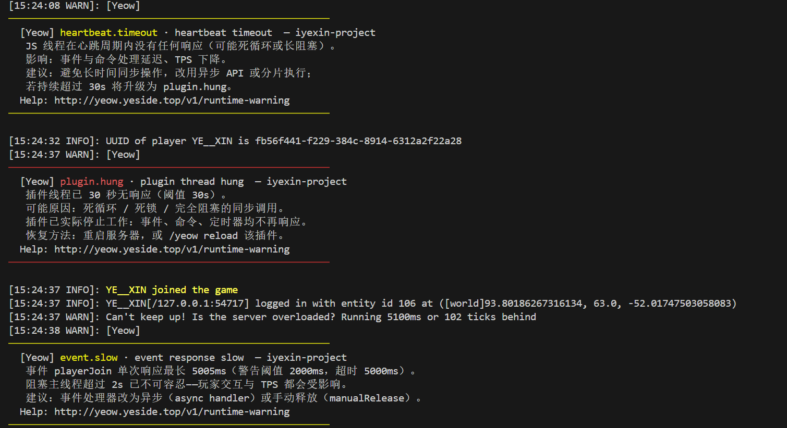

# Runtime Warning Guide

Yeow has a built-in **early warning engine** (enabled by default, `profile.warnings-enabled: true`), detecting abnormal behavior with a once-per-second window aggregation, outputting **bilingual warnings** (Chinese and English) in the console, helping developers and server owners quickly locate performance issues.

> **All warnings are not fatal errors** and will not cause server crashes. If you're not the developer of the corresponding plugin, you can ignore them.

> **Output Style**: Alerts are compact paragraphs wrapped in **two colored separator lines** (critical=red / warning=yellow / info=blue), adapting to different terminal widths.



---

## Scheduling Semantics (Prerequisite for Understanding Alerts)

The three-level scheduling queues have different semantics, detection and alerts **only target real-time queues**:

| Queue             | Carries                                            |         Allows Backlog?         |
| ----------------- | -------------------------------------------------- | :-----------------------------: |
| **HIGH / NORMAL** | Real-time and interactive response (commands, events, async API) | ❌ **Should not backlog** — backlog is a problem |
| **LOW**           | Large batch repetitive tasks (auto-demoted / manually specified low) | ✅ **Allows backlog and delayed completion |

Therefore: All "backlog/saturation" type alerts only count HIGH/NORMAL; LOW queue backlog and delay are design semantics, not alerted, not counted in health score.

---

## Alert Types

| Code                  | Severity | Trigger Condition                                   | Data Source  |
| --------------------- | -------- | --------------------------------------------------- | ------------ |
| `heartbeat.timeout`   | Warning 🟡 | JS thread single heartbeat roundtrip >200ms         | Heartbeat ping |
| `plugin.hung`         | Critical 🔴 | JS thread >30s continuous no response               | Heartbeat ping |
| `event.slow`          | Warning 🟡 | Event response >**2s** (not timed out)              | Event bridge |
| `event.timeout`       | Warning 🟡 | Event wait timeout (**5s**, force-released)         | Event bridge |
| `tab.slow`            | Warning 🟡 | Completion response >**500ms** (not timed out)      | Command bridge |
| `tab.timeout`         | Warning 🟡 | Completion wait timeout (1s, returned empty list)   | Command bridge |
| `budget.congested`    | Warning 🟡 | Recent 40 ticks HIGH/NORMAL backlog ≥ **35** times  | Scheduler   |
| `budget.restored`     | Info 🔵   | Consecutive 40 ticks no backlog, budget restored    | Scheduler   |
| `scheduler.saturated` | Warning 🟡 | HIGH/NORMAL execution time >**80%** of tick duration | Scheduler   |

### Event 2s Warning vs 5s Timeout (Design Semantics)

- **2s (`event.slow`)**: Blocking main thread for 2 seconds is intolerable — even if event eventually completes, player interaction and TPS are already degraded, **developers must take seriously**
- **5s (`event.timeout`)**: Runtime's wait limit, once reached event is force-released (previous cancellation/modifications take effect)

Two independent alerts: slow but completed → `event.slow`; timeout → `event.timeout`.

---

## Detailed Alert Explanations

### heartbeat timeout

**Detection Mechanism:** Yeow sends one heartbeat ping to each plugin JS thread per second. Triggered by either:
- **No response at all** — No pong received within window after ping sent (infinite loop, long block)
- **Slow response** — Single roundtrip exceeds 200ms

> **Virtual plugins (Worker) do not trigger this alert by default**: Workers typically handle compute-intensive tasks; prolonged JS thread occupation without responding to heartbeats is expected behavior (`plugin.hung` still uses original detection logic).

**Meaning:** Plugin JS thread temporarily blocked (detectable in 1-2 seconds in no-response scenarios; upgrades to `plugin.hung` after 30s). Possible causes:
- Long synchronous loops (e.g., iterating over large numbers of chunks setting blocks)
- Synchronous IO operations blocking the event loop
- Large message backlog

**Solutions:**
1. Check for long synchronous loops → Switch to async operations or manual chunking
2. Check for synchronous network/file IO → Use async API

### event slow / event timeout

**Detection Mechanism:** Event handler single response >2s → `event.slow`; wait >5s force-released → `event.timeout`.

**Meaning:** Event processing logic blocked main thread. Main thread cannot execute other tasks while spinning waiting for JS results.

**Solutions:**
1. Use `async` handler (immediately releases event, logic executes asynchronously)
2. Split heavy logic into segments after `setTimeout` / `await`

```js
// ❌ Long synchronous operation blocks main thread
eventOn('playerJoin', (e) => {
    const data = heavySyncCalculation(); // Takes 3s → event.slow
    e.player.sendMessage(data);
});

// ✅ Returns Promise, immediately releases event
eventOn('playerJoin', (e) => {
    return Promise.resolve().then(() => {
        const data = heavySyncCalculation();
        e.player.sendMessage(data);
    });
});
```

### tab slow / tab timeout

**Detection Mechanism:** Completion callback >500ms → `tab.slow`; wait >1s → `tab.timeout` (returns empty list).

**Meaning:** Completer takes too long, causing lag when player inputs commands.

**Solutions:** Optimize completer; cache results.

### plugin thread hung

**Detection Mechanism:** Consecutive >30s no heartbeat response.

**Meaning:** JS thread stuck in **infinite loop / deadlock / complete block**, plugin functionality completely stopped.

**Solutions:** Check for exitless `while(true)` in `onLoad`/`onInit`; move heavy computation to native services; `/yeow reload` or restart server.

### budget.congested / budget.restored (real-time queue backlog)

**Detection Mechanism:** Recent 40 ticks HIGH/NORMAL queue backlog count ≥35 (sliding window, `backlog-threshold`).

**Meaning:** Task submission speed exceeds processing capacity, real-time interaction degraded. Runtime will automatically expand tick budget (see [Dynamic Expansion](#dynamic-expansion)); recovers and alerts after backlog cleared.

> **LOW batch queue not counted** — large batch repetitive tasks allow backlog and delay.

> **Recommendation**: If operations are heavy (e.g., triggering chunk generation), manually declare **low priority** — all task channel API methods support trailing task configuration `{ priority: 'low' }` (e.g., `world.getChunkAtSync(x, z, { priority: 'low' })`), putting heavy tasks in LOW queue, avoiding crowding out real-time interactions and triggering this alert. See [Advanced Knowledge - Priority Parameters](advanced.md#priority-parameters).

### scheduler.saturated

**Detection Mechanism:** HIGH/NORMAL execution time within a window exceeds 80% of tick total duration.

**Meaning:** Real-time scheduling near capacity, LOW batch tasks will be indefinitely postponed, interactive response degraded.

---

## Configuration

All thresholds and strategies configured in `plugins/Yeow/runtime/config.yml`:

```yaml
profile:
  warnings-enabled: true            # Early warning engine (enabled by default; independent of full analysis)
  warn-cooldown-seconds: 1800       # Same-type alert cooldown (30min)
  latency-warn-threshold-ms: 200    # Heartbeat timeout threshold (ms)
  event-slow-threshold-ms: 2000     # Event response warning threshold (ms; timeout still 5000)
  tab-slow-threshold-ms: 500        # Completion response warning threshold (ms; timeout still 1000)
  callback-timeout-event-ms: 5000   # Event callback wait limit (ms, runtime effective)
  callback-timeout-tabcomplete-ms: 1000 # Completion wait limit (ms, runtime effective)
  suspend-warn-seconds: 30          # Plugin hang detection threshold (s)
  backlog-threshold: 35             # Expansion signal: backlog count threshold in 40 ticks
  backlog-window-ticks: 40          # Backlog statistics window
  scheduler-saturation-pct: 80      # Scheduler saturation alert percentage
```

> `callback-timeout-*` is **runtime behavior** (actual wait limit for event bridge/command bridge); `*-slow-threshold-*` is **alert threshold** (earlier warning, but doesn't affect behavior).

---

## Alert Cooldown Mechanism

Cools down by **(code, plugin)** granularity: Same plugin same code alert outputs at most once during cooldown period; different plugins/different codes don't affect each other. Cooldown defaults to 30 minutes.

---

## Dynamic Expansion

**Runtime component** (independent of early warning engine) automatically adjusts tick budget, enabled by default:

- **Expansion signal**: Recent 40 ticks HIGH/NORMAL backlog ≥35 times (`backlog-threshold`) → Budget ×1.3 (exponential stacking, limit 3.0x)
- **Degradation**: Consecutive 40 ticks no backlog → Gradually ÷1.3 back to baseline
- **Reach limit**: Still backlog after reaching limit → Output critical warning

```yaml
profile:
  scaler:
    enabled: true              # Whether to enable dynamic expansion
    expansion-factor: 1.3      # Expansion multiplier each time
    max-multiplier: 3.0        # Maximum expansion limit (3x = 60ms/tick)
```

---

## Full Analysis (profile.enabled)

`/yeow profile` and `/yeow track` require `profile.enabled: true` (disabled by default, avoiding per-task collection overhead). When enabled:
- Per-task/per-plugin time breakdown, task heatmap
- `/yeow profile` outputs health score + real-time/batch queue metrics + per-plugin breakdown, saves detailed report file
- `/yeow track <plugin> <seconds>` single plugin deep tracking

Early warning engine does not depend on this switch.

---

## FAQ

### Q: Heartbeat timeout 200ms is very strict, should it be relaxed?

200ms is reasonable: Async IO and async API don't affect heartbeat response. If confirmed no issue, ignore single warnings within cooldown period, or increase `latency-warn-threshold-ms`.

### Q: Is event 2s warning too strict?

This is intentional design: Blocking main thread for 2s is enough to cause noticeable lag. `event.slow` is just a reminder, won't force-release event; only 5s timeout will. If plugin has legitimate long tasks, should switch to async handler to release main thread, not relax threshold.

### Q: Will LOW queue backlog trigger alerts?

No. LOW queue carries large batch repetitive tasks, allows backlog and delayed completion — this is design semantics. If LOW tasks long-term not executing, check if real-time queue is saturated (`scheduler.saturated`).

### Q: Will plugin thread hang automatically recover?

Probably not (infinite loops don't exit themselves). Development environment can hot reload (5s forced destroy old context); production environment `/yeow reload` or restart server.

### Q: How to completely disable certain type of alert?

Set `profile.warnings-enabled: false` to disable entire early warning engine (full analysis unaffected); or increase corresponding threshold to indirectly disable.

---

## More Information

- [Getting Started](getting-started.md) — Basic usage
- [Advanced Knowledge](advanced.md) — Architecture and thread model
- [CLI Reference](cli.md) — Command usage